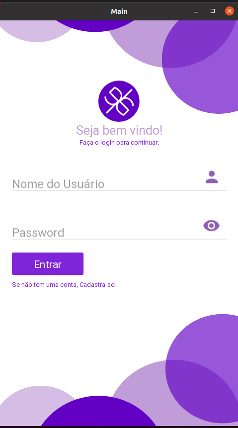

# Aplicação Mobile em desenvimento para fins de estudo.

<h4 align=center>

</h4>

 

* To contribute, follow the ONSHOP layout first
* <a href="CONTRIBUITING.MD">CONTRIBUITING<a/>
  

  ## UI/UX DESIGN
  [
Crisvan dos Santos](https://github.com/CrisvanSantos)

<a href="ONSHOP/portfólio%20de%20onshop.png">

<a/>

 
 
 

**Run windows**

`python main.py -m screen:droid2,portrait`

**Run Linux**

`python3 main.py -m screen:droid2,portrait`

 
 
 

> Open source